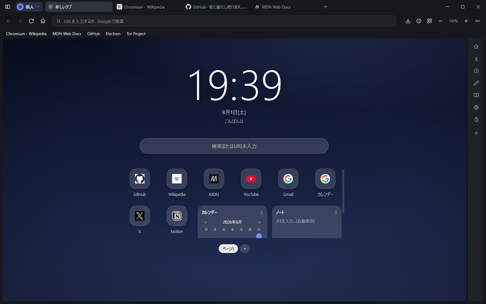
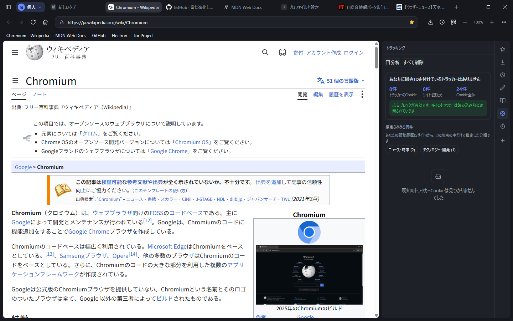
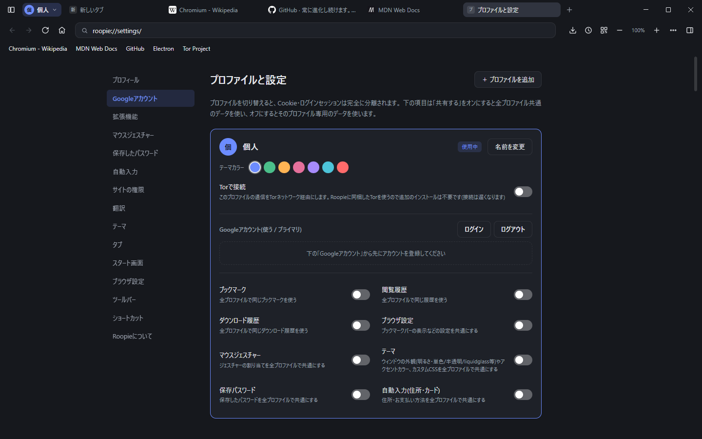
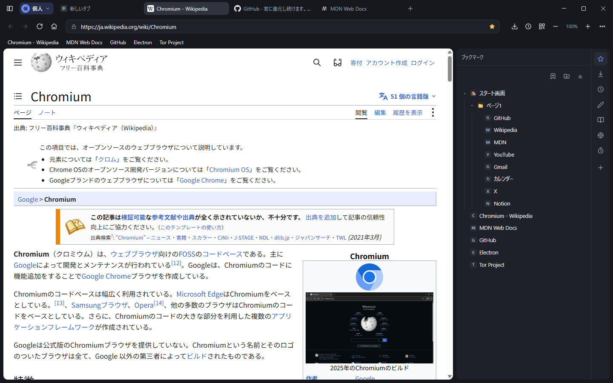
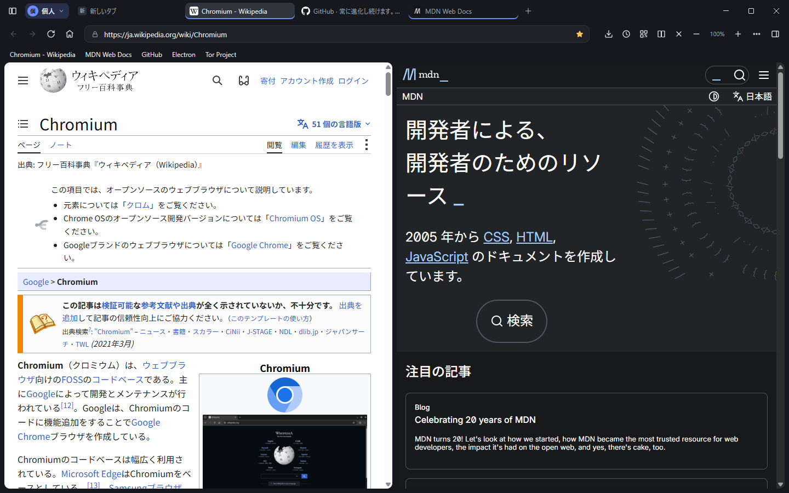
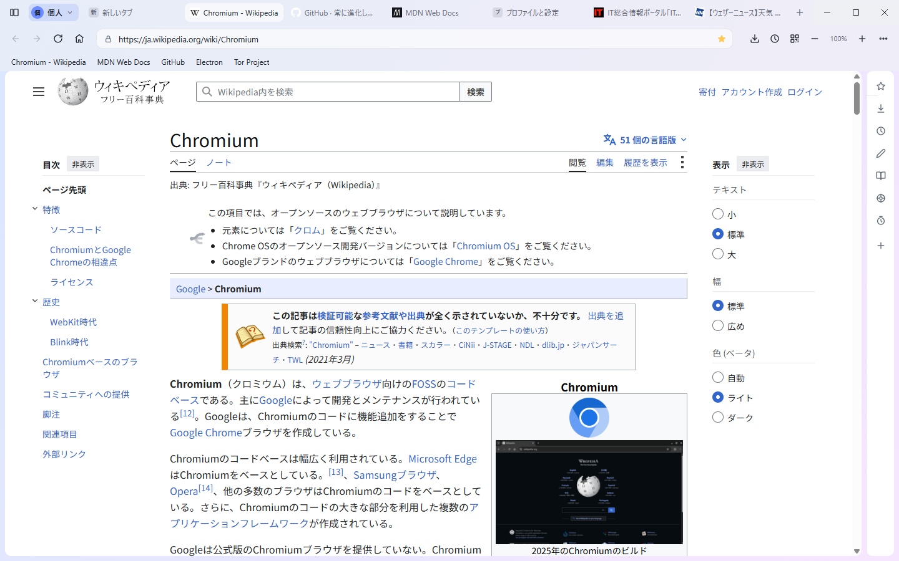

<div align="center">


# Roopie

**自分好みに組み替えられる、Chromiumベースのウェブブラウザ。**
プライバシーの「見える化」と、ウィンドウごとに切り替わるプロファイルが軸です。

[](https://github.com/eugene-rb/Roopie/actions/workflows/release.yml)
[](https://github.com/eugene-rb/Roopie/releases/latest)
[](https://github.com/eugene-rb/Roopie/releases)
[](LICENSE)
[](https://github.com/eugene-rb/Roopie/releases/latest)
[](https://www.electronjs.org/)

[**ダウンロード**](https://github.com/eugene-rb/Roopie/releases/latest) ・
[機能](#特長) ・
[開発](#開発) ・
[貢献](CONTRIBUTING.md) ・
[English](README.en.md)



</div>

---

## 特長

### 追跡されている状態が数字で見える

広告とトラッカーを標準で遮断したうえで、サイドパネルの「トラッキング」が
**いま自分に固有IDを付けている企業**をCookieから割り出して一覧にします。企業ごとに削除でき、
閲覧履歴から推定される「興味の分類」もその場で確認できます(推定は端末の中だけで行い、外へは送りません)。



### プロファイルは「ウィンドウ単位」

仕事用と個人用を**同時に別ウィンドウで**開けます。Cookieとログインセッションは完全に分離。
ブックマーク・履歴・パスワード・自動入力・ジェスチャー・テーマなどは、**項目ごとに**共有するか分けるかを選べます。
プロファイル単位で「Torで接続」を有効にでき、Tor本体を同梱しているので追加インストールは要りません。



### サイドパネル(F4)

ブックマーク / ダウンロード / 履歴 / メモ / リーディングリスト / トラッキング / タイマー / 再生中、
そして**好きなサイトを常駐させられるWebパネル**。同じアイコンをもう一度押すと畳む、`+` で追加する、という
Vivaldi の流儀に合わせています。



### 画面分割・タブまわり

1つのウィンドウを左右/上下に分割して2ページを並べられます。タブはグループ化・縦配置に対応し、
**ウィンドウをまたいでドラッグ**しても再読み込みされません(再生中の動画も止まりません)。



### 見た目もプロファイルごと

ライト/ダーク、単色、グラデーション、パターン、Windows 11 の半透明(acrylic)、アクセントカラー、カスタムCSS。
スタート画面は時計・カレンダー・ノート・天気・ニュースのウィジェットとショートカットをドラッグで並べ替えられます。



### そのほか

| | |
|---|---|
| **裏タブが勝手に鳴らない** | 裏で開いたタブは読み込みはするが、そのタブを選ぶまで再生を始めさせません(ミュートや「鳴ってから一時停止」ではありません) |
| **翻訳** | ページ全体の翻訳と選択テキストの翻訳。Edge と同じ流儀のドロップダウン |
| **マウスジェスチャー** | 右ドラッグで戻る/進む/タブを閉じる など。割り当てはプロファイルごと |
| **パスワード・自動入力** | パスワードの保存と自動入力、住所・カードのオートフィル |
| **サイトの権限** | カメラ/マイク/現在地/通知/全画面を「許可 / 今回だけ / ブロック」の3択で |
| **メディアプレイヤー** | 再生中のタブを四隅のミニプレイヤーから操作 |
| **拡張機能** | Chrome ウェブストアの拡張機能を部分的にサポート([既知の制約](#既知の制約)) |
| **自動更新** | 起動時と15分ごとに新版を確認し、裏でダウンロードして再起動時に適用 |

## インストール

[Releases](https://github.com/eugene-rb/Roopie/releases/latest) から `Roopie-Setup-x.x.x.exe` をダウンロードして実行してください(Windows 10 / 11、64bit)。

> [!NOTE]
> コード署名証明書を持っていないため、初回起動時に SmartScreen の警告が出ます。
> 「詳細情報」→「実行」で続行できます。ソースとビルド手順は全て公開されているので、
> 気になる場合は [`npm run dist`](#開発) で自分でビルドしたものを使ってください。

インストール後は自動で更新を確認し、新しいバージョンがあれば裏でダウンロードして再起動時に適用します。

## 開発

必要なもの: Node.js 24 以上 と Windows。

```bash
npm ci
npm start              # 起動
npm run start:verify   # コンソールエラーをターミナルに出して起動(検証用)
npm run build:css      # tailwind.css → src/renderer/pages/app.css(生成物は直接編集しない)
npm run dist           # インストーラーをローカルにビルド(dist/)
```

動作確認は使い捨てのスクリプトを書かず、`scripts/` の再利用できる検証スクリプトを使います
(いずれも `npx electron scripts/<name>.js` で実行し、自分で OK / NG を出力します)。

| スクリプト | 対象 |
|---|---|
| `test-onboarding.js` | 初回起動のイントロ / アップデート後の変更点 |
| `test-multi-profile.js` / `test-profile-switch-ui.js` | プロファイル |
| `test-window-theme.js` | ウィンドウの外観テーマ |
| `test-tab-scroll.js` / `test-tab-groups.js` / `test-window-tabs.js` | タブ |
| `test-translate.js` | 翻訳 |
| `test-site-permissions.js` | サイトの権限 |
| `test-autoplay-policy.js` | 裏タブの自動再生対策 |
| `test-trackers-panel.js` | トラッキング分析 |
| `test-autofill-main.js` / `test-autofill-preload.js` | パスワード・自動入力 |
| `test-tor.js` | 同梱Torの起動〜接続(30〜90秒) |
| `gen-screenshots.js` | このREADMEのスクリーンショット生成 |

構成の詳細と設計上の決まりごとは [DEVELOPMENT.md](DEVELOPMENT.md)、
開発の進め方は [CONTRIBUTING.md](CONTRIBUTING.md) を参照してください。

### アーキテクチャ

Electron のメインプロセスがブラウザ本体で、タブは `WebContentsView`、ブラウザのUI(タブバー・ツールバー)は
別レンダラーです。データはすべて**プロファイル単位の束**にまとまっていて、各機能は `browser.bundleFor(profileId)` から引きます。

| ファイル | 責務 |
|---|---|
| `src/main/browser.js` | ブラウザ本体。プロファイル単位のデータ、ウィンドウ生成、状態配信 |
| `src/main/tab-manager.js` | タブ(WebContentsView)の管理とレイアウト、画面分割 |
| `src/main/ipc.js` | IPCの受付。`windows.contextFor(e.sender)` で送信元ウィンドウに振り分け |
| `src/main/*.js` | 広告ブロック・トラッキング分析・Tor・翻訳・権限などの各機能 |
| `src/preload/*.js` | ページ側に入る preload(自動入力・ジェスチャー・翻訳・自動再生の抑止) |
| `src/renderer/` | ブラウザのUIと内部ページ(スタート画面・設定・履歴など) |

### リリース

`master` へ push すると GitHub Actions がインストーラーをビルドして Releases へ公開し、
インストール済みの Roopie が自動更新します。バージョンは `0.1.<Actionsの実行番号>`。
メジャー/マイナーを上げるときは `.github/workflows/release.yml` の `VERSION_BASE` を変更し、
あわせて `src/renderer/pages/release-notes.json` に変更点を1件追加します(次回起動時に全ユーザーへ1度だけ表示されます)。

## 同梱している Tor について

プロファイルごとの「Torで接続」を追加インストール無しで使えるよう、Tor Project 公式の
[Tor Expert Bundle](https://www.torproject.org/download/tor/)(Windows x86_64)から `tor.exe` を同梱しています。

- 取得は `npm run fetch:tor`(`scripts/fetch-tor.js`)。公開されている SHA256 と照合し、起動確認まで行います
- **リリースのたびにCIが最新の安定版を取り直す**ので、Roopieを更新すると同梱のTorも新しくなります。同梱バージョンは設定画面のTorの状態表示で確認できます
- ブリッジ用の pluggable transports(obfs4/snowflake)と geoip は同梱していません(サイズ削減)
- 既に Tor Browser や素の Tor が動いている場合はそちらを優先して使います。`%APPDATA%\Roopie\tor\tor.exe` を置けば自分でビルドしたものに差し替えられます
- tor 本体のライセンスは同梱の `resources/tor/docs/` を参照してください。Roopie は tor を別プロセスとして SOCKS5 経由で利用するだけで、リンクはしていません

## 既知の制約

- uBlock Origin などのブロッキング型拡張は動きません(Electronの制約。内蔵の広告ブロックで代替しています)
- シークレットウィンドウでは拡張機能が動きません(Electronの制約)
- 検閲された回線からのブリッジ接続には未対応です(pluggable transports 非同梱)
- 対応OSは今のところ Windows のみです

## 貢献

不具合の報告・機能の提案・Pull Request を歓迎します。
まず [CONTRIBUTING.md](CONTRIBUTING.md) を読んでください(検証スクリプトの決まりごとがあります)。
参加にあたっては [行動規範](CODE_OF_CONDUCT.md) に従ってください。
脆弱性を見つけた場合は Issue ではなく [SECURITY.md](SECURITY.md) の手順で報告してください。

## ライセンス

[MIT](LICENSE) © eugene-rb

同梱・利用している主なOSS: [Electron](https://www.electronjs.org/)、
[Ghostery adblocker](https://github.com/ghostery/adblocker)、
[electron-chrome-extensions](https://github.com/samuelmaddock/electron-browser-shell)、
[Tailwind CSS](https://tailwindcss.com/)、[Preline UI](https://preline.co/)、[Tor](https://www.torproject.org/)。
